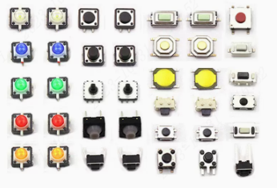
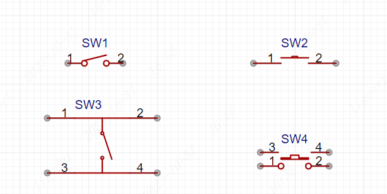
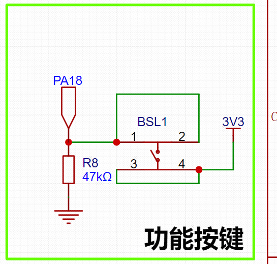
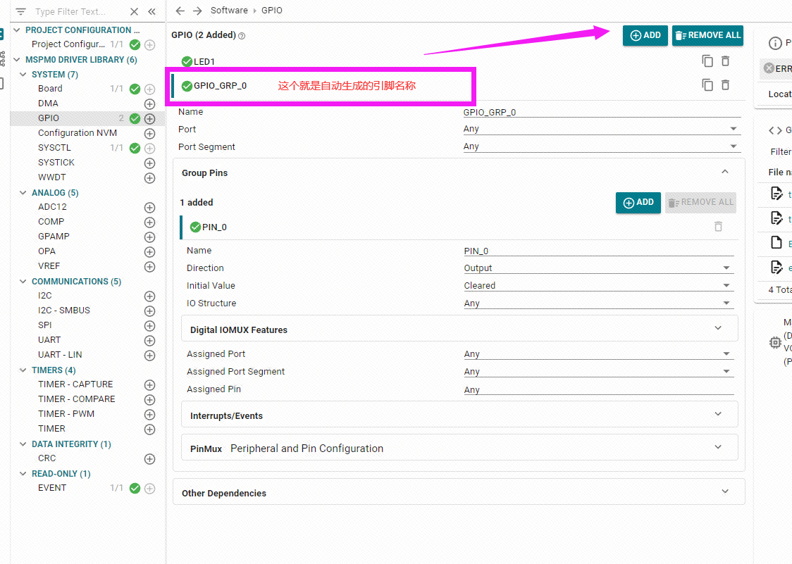
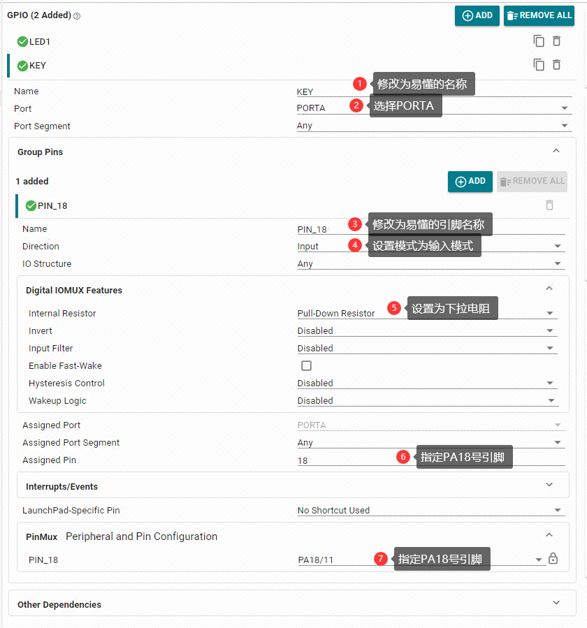
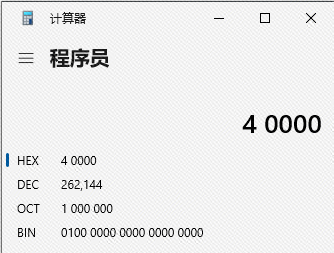
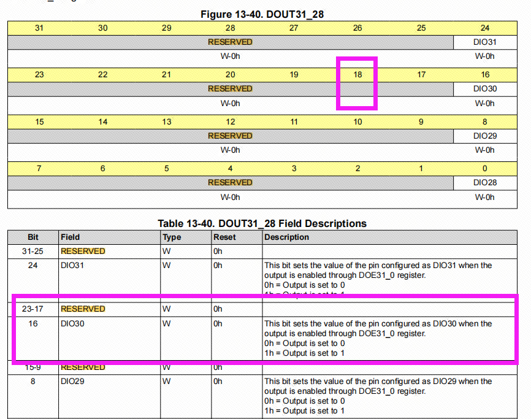

# 按键控制

## 独立按键基础知识

独立按键是一种简单的输入设备，广泛应用于各种电子设备中，用于实现基本的用户交互。它们的工作原理通常基于一个简单的机械开关，当按下按键时触发某些操作。独立按键可以有多种尺寸、形状和颜色，便于用户辨识和使用。


## 独立按键结构组成

独立按键的主要结构组成包括：按钮、外壳、弹簧、触点、导电片和引脚。当按下按键时，导电片触碰到触点，从而形成一个闭合电路。



## 独立按键原理

独立按键原理主要是基于机械触点和电气触点之间的关系。当按键未被按下时，通常触点是分开的，电路是断开的。当用户按下按键时，触点在弹簧和导电片的作用下形成闭合，这时电路连通，微控制器能够读取到该按键触发的信号。


## 消抖措施

由于机械按键在闭合和分开时可能产生的机械振动(相当于弹簧)，导致开关状态在短时间内多次变换，这就是按键抖动现象。消抖措施主要分为软件消抖和硬件消抖：

软件消抖：主要是通过编程的方法，设定一个延迟或计时器，确保在一定的时间内只读取一次按键状态，避免抖动对程序的影响。  
硬件消抖：在按键电路中加入元器件如电阻、电容组成的RC低通滤波器，对按键信号进行平滑处理，降低抖动的影响。

## 独立按键驱动原理

独立按键驱动是为了让微控制器能识别按键的状态，而微控制器正好可以识别高电平和低电平，所以大多数的按键都是通过给按键的一端接入高电平，一端接入GPIO；或者是给按键的一端接入低电平，一端接入GPIO。通过检测连接按键的引脚有没有发生电平变化，就可以知道按键是否按下。

## 独立按键原理图

在开发板的原理图中，将PA18引脚接入了一个按键。采用的检测方式是通过给按键的一端接入高电平，一端接入GPIO。在没有按下按键时，因为下拉电阻R8（47KΩ）的存在，导致一直处在低电平；当按键按下时，PA18引脚将被变为高电平的3.3V。这样高低电平的变化，就可以让开发板检测到按键的状态。
   
> ⚠说明  
PA18引脚为MSPM0G3507芯片的BSL引脚，用于启动芯片的BootLoader模式，非特殊情况，请确保在给开发板通电时，PA18引脚为低电平，否则将会启动BootLoader模式，导致无法正常执行之前所下载的代码。此处仅作为按键输入例程的展示。



## 输入模式配置

在单片机中，引脚输入模式指的是设置某个引脚为输入引脚，用来接受外部信号的方式。而我们要知道接入按键的引脚上的状态，那不就是输入功能吗。接收外部信号 = 按键的高低电平变化。

### 配置指定引脚为输入模式
在sysconfig中，左侧可以选择MCU的外设，我们找到并点击GPIO选项卡，在GPIO中点击ADD，就可以添加引脚外设。



配置引脚的参数。



## 按键点灯实验

LED的控制使用的是之前LED章节的内容。那么我们应该怎么读取引脚的状态，用来控制LED亮还是灭呢？

使用函数 `uint32_t DL_GPIO_readPins(GPIO_Regs* gpio, uint32_t pins)` 可以读取引脚的状态。 需要输入两个参数：

>参数说明  
`gpio`：读取的GPIO端口。G3507芯片只有GPIOA和GPIOB端口，这里选择`GPIOA`。  
`pins`：读取的引脚号。根据我们sysconfig配置的引脚名称，这里写入的是`KEY_PIN_18_PIN`。

它会返回的参数： 类型为uint32_t ，返回的是对应引脚的状态位。比如以PA18为例。当PA18引脚检测到低电平时，返回的值是0；当PA18引脚检测到高电平时，对应的32位寄存器中PA18的位将会被置1，返回的值为0x40000，换为2进制就是：100 0000 0000 0000 0000。



从代码一直查找到用户手册的寄存器，可以知道，二进制的 100 0000 0000 0000 0000 对应的就是PA18引脚。数据手册中，是从0开始往左边算，二进制的100对应的就是PA2号引脚为高电平，10000对应的就是PA4引脚为高电平。



现在我们知道了如何读取对应引脚的状态，那么在empty.c中编写以下代码：（主要是要有main函数的文件）

```c
#include "ti_msp_dl_config.h"

int main(void)
{

        SYSCFG_DL_init();

        while (1)
        {
                //如果读取到的引脚值大于0，说明PA18引脚为高电平
                if( DL_GPIO_readPins(KEY_PORT, KEY_PIN_18_PIN) > 0 )
                {
                        DL_GPIO_setPins(LED1_PORT,LED1_PIN_14_PIN);  //LED控制输出高电平
                }
                else//如果PA18引脚为低电平
                {
                        DL_GPIO_clearPins(LED1_PORT,LED1_PIN_14_PIN);//LED控制输出低电平
                }
        }
}

```
将代码编译烧录到开发板中即可看到，当按下按键时LED亮，松开按键时LED灭。

注：