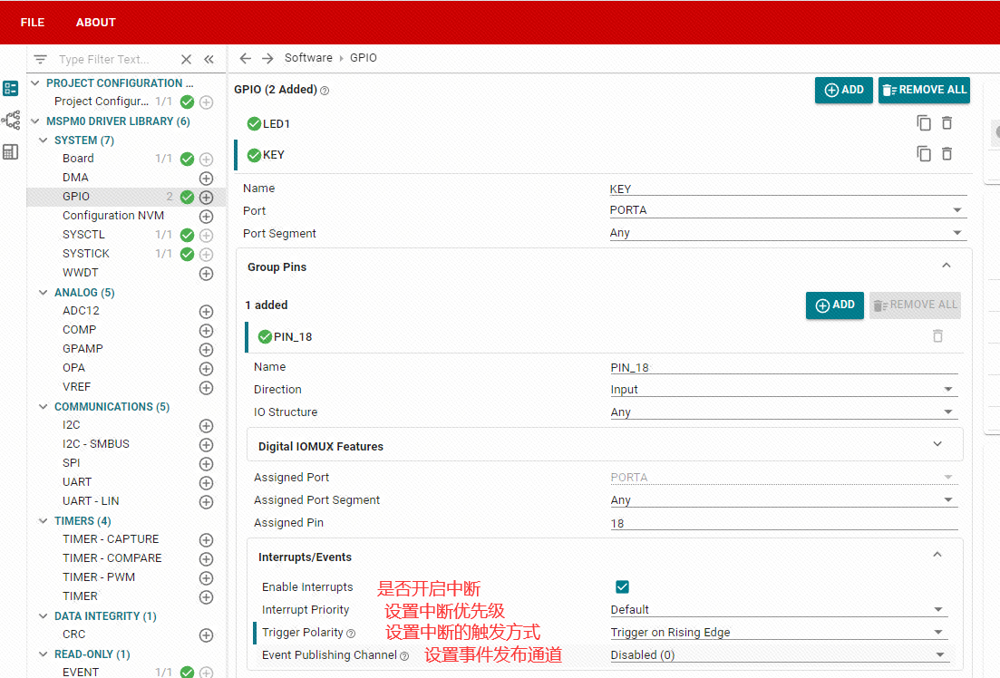

# 外部中断

## 什么是中断

在微处理器或微控制器的世界中，中断是一种特殊的事件，它会打断和暂时挂起当前正在执行的程序，以便处理一个特定的状况或者事件。例如按下按钮、到达定时器时间或收到序列口数据。中断是一个非常重要的计算机系统概念，它通过异步的方式对这些特定情况做出响应。这里举一个例子，比如我们正在敲代码，突然有一个电话打过来，这时我 们停止敲代码转而去接电话，然后在电话聊完事情之后继续敲代码。这里面的电话就相当于一个中断，打断我们当前做的事情，接电话聊事情就相当于中断需要去执行的事情，也就是中断服务程序。

  中断可以分为硬件中断和软件中断两种类型。

  硬件中断通常由外部设备的物理事件引发，如按下按钮、达到定时器的时间、或数据到达串行端口。当这些事件发生时，微处理器会立即暂停其当前的任务，并跳转到一个预先定义的中断服务程序（ISR）来响应该事件。

  软件中断则是由软件指令引发，通常用于更复杂的处理任务。像操作系统的系统调用就使用了软件中断。

## 外部中断

我们在做按键实验时，虽然能实现读取 GPIO口输入功能，但代码是一直在检测IO输入口的变化，如果我们后续加入了大量的代码，就需要花费很长的时间才能轮询到按键检测部分，因此效率不高。特别是在一些特定的场合，比如某个按键，可能 1 天才按下一次去执行相关功能，这样我们就浪费大量时间来实时检测按键的情况。为了解决这样的问题，我们引入外部中断概念，顾名思义，就是当按键被按下（产生中断）时，才去执行相关功能。这大大节省了 CPU 的资源，因此中断在实际项目中应用非常普遍。

外部中断是硬件中断的一种，它由微控制器外部的事件引发。微控制器的某些引脚被设计为对特定事件的发生做出响应，例如按钮的按压、传感器的信号改变等。这些指定的引脚通常被称为“外部中断引脚”。

在发生外部中断事件时，当前的程序执行会被立即停止，并跳转到对应的中断服务程序（ISR）进行处理。处理完毕后，程序会返回到被中断的地方继续执行。

对于嵌入式系统、实时系统来说，外部中断的使用是非常重要的，能帮助系统对外部事件进行即时响应，大大提高了系统的效率和实时性。提供了许多引脚作为可用的外部中断引脚，可以通过配置这些引脚来进行外部中断实验。

MSPM0系列把CPU中断，DMA触发，以及外设触发外设，都统称为事件（Event），触发源称为事件发布者（Event Publisher），相应中断的外设被称为事件订阅者（Event Subscriber）。

事件管理器传输的事件包括：

作为中断请求 (IRQ) 传输到 CPU 的外设事件（静态事件） – 示例：GPIO 中断会发送到 CPU
作为 DMA 触发器传输到 DMA 的外设事件（DMA 事件） – 示例：传输到 DMA、请求 DMA 传输的 UART 数据接收触发器  
传输到另一个外设以直接触发硬件中操作的外设事件（通用事件） – 示例：TIMx 计时器外设将周期性事件发布到 ADC 订阅者端口，ADC 使用该事件触发采样开始（ADC触发采样）

下图为MSPM0系列的事件安排表。其中绿色表示事件发布者（发送），将外设上发生的事件告诉总线；红色为事件订阅者（接收），接收总线上的事件情况。


## 外部中断的作用和优势

外部中断功能在开发中具有以下作用和优势：

实时响应外部事件：外部中断功能可以让你在检测到外部事件触发时立即作出响应。这些外部事件可以是来自传感器、按钮、开关、接收到的信号等等。通过外部中断，就可以实时地捕捉到这些事件并执行相应的操作，而无需频繁地轮询或等待。  
节省计算资源：外部中断允许你将处理外部事件的任务转移给芯片的硬件，从而节省了处理器的计算资源。相比于软件轮询方式，外部中断可以降低对处理器的负担，使其可以更有效地利用其他资源进行更复杂的任务。  
精确的事件捕捉：外部中断功能能够以非常精确的方式捕捉外部事件的触发。你可以通过配置中断触发方式（如上升沿、下降沿、任意电平等）来适应不同的外部事件，并在事件发生时立即中断当前程序的执行，转而执行中断服务函数。  
高优先级处理：外部中断可以设置为高优先级处理，优先于当前正在执行的程序。这对于需要立即响应的重要事件非常有用，如紧急通知、传感器检测等。当外部事件触发时，处理器将立即转移到中断服务函数执行，确保及时、准确地处理相关操作，避免对处理程序的延迟。  
多路中断处理：支持多路外部中断，你可以将多个外部事件与不同的中断引脚相连，从而实现对多个事件的并行处理。这使得你可以处理多个传感器、开关等外部事件，提高系统的灵活性和扩展性。  

总之，外部中断功能提供了实时响应、节省计算资源、精确事件捕捉、高优先级处理和多路中断处理等优势。它为我们提供了更加灵活、高效的方式来处理外部事件，并帮助构建更强大、可靠的应用。

## 外部中断的配置

本次的教程中，将使用PA18按键触发PA14的LED点亮和熄灭，软件上使用CPU中断方式。LED的PA14引脚的配置请参考 点亮LED灯 章节。

### 配置引脚为输入中断模式

在sysconfig中，左侧可以选择MCU的外设，我们找到并点击GPIO选项卡，在GPIO中点击ADD，就可以添加引脚外设。

配置引脚的参数。


配置引脚外部中断。芯片上引出的所有GPIOA端口，都可以设置外部中断功能。本案例开启了中断，中断优先级为默认，中断的触发方式为上升沿触发（按键按下后引脚被拉高为高电平，从低电平变为高电平的过程称为上升沿），事件发布通道不开启(开启之后将会把外部中断事件发布到设置的通道上，其他外设就可以通过通道直接订阅事件)。



将以上配置保存，编译更新。

## 外部中断点灯实验

我们配置好了引脚的中断之后，还要手动编写外部中断的中断服务函数，因为我们开启的引脚下降沿中断，当我们的按键从按下到松开的时候产生的下降沿，就会触发一次中断，触发中断就会执行中断服务函数。各个中断的中断服务函数名称已经被写死，不可修改，否则无法正常进入中断服务函数。关于中断服务函数的名称是什么，可以在工程的启动文件中找到各个中断的中断服务函数名称。

根据MSPM0G系列的用户手册，可以知道GPIO的中断触发后，都是通过GRP1线将中断发布到总线，总线识别到之后就进入中断服务函数中执行内容。


所以在代码方面，我们得这么写：

```c
#include "ti_msp_dl_config.h"

int main(void)
{
    SYSCFG_DL_init();
    NVIC_EnableIRQ(KEY_INT_IRQN);//开启按键引脚的GPIOA端口中断

    while (1)
    {

    }
}


void GROUP1_IRQHandler(void)//Group1的中断服务函数
{
    //读取Group1的中断寄存器并清除中断标志位
    switch( DL_Interrupt_getPendingGroup(DL_INTERRUPT_GROUP_1) )
    {
        //检查是否是KEY的GPIOA端口中断，注意是INT_IIDX，不是PIN_18_IIDX
        case KEY_INT_IIDX:
            //如果按键按下变为高电平
            if( DL_GPIO_readPins(KEY_PORT, KEY_PIN_18_PIN) > 0 )
            {
                //设置LED引脚状态翻转
                DL_GPIO_togglePins(LED_PORT, LED_PIN_14_PIN);
            }
        break;
    }
}

```

按照以上的配置和代码，将其烧录到开发板中，即可看到可以使用按键控制LED的状态翻转。