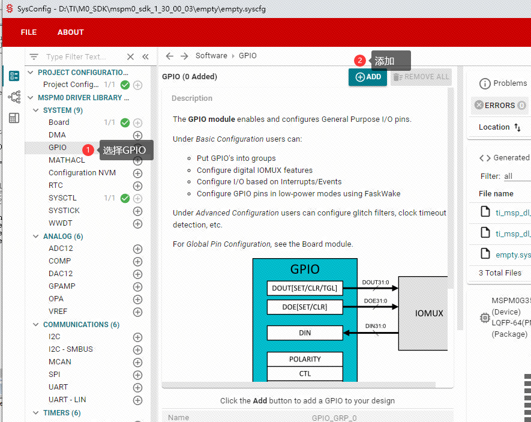
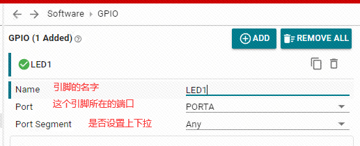
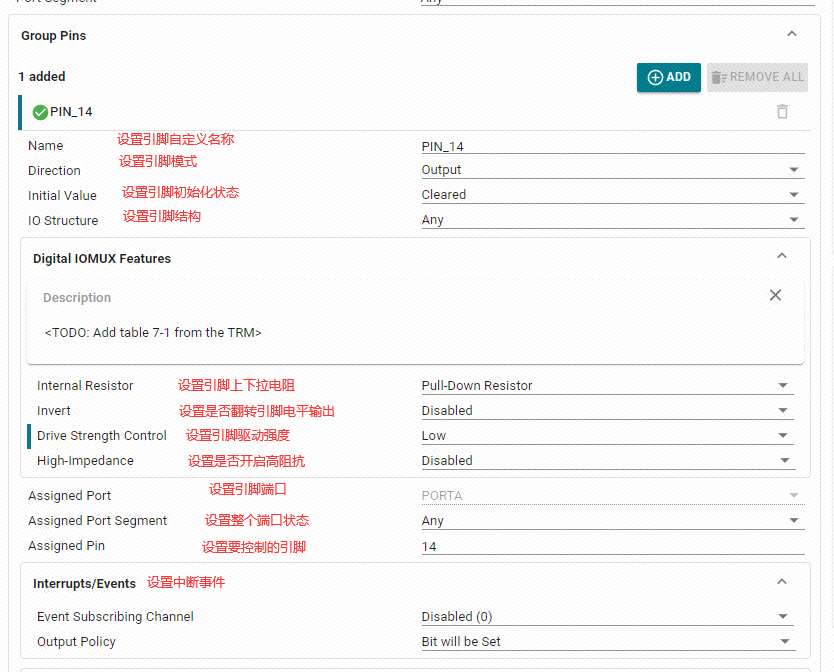
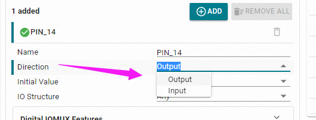
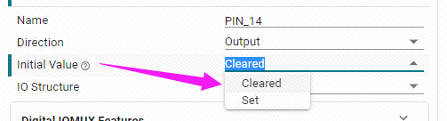
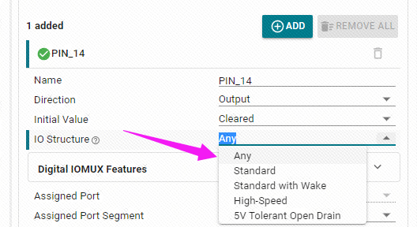
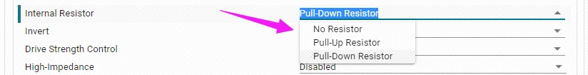
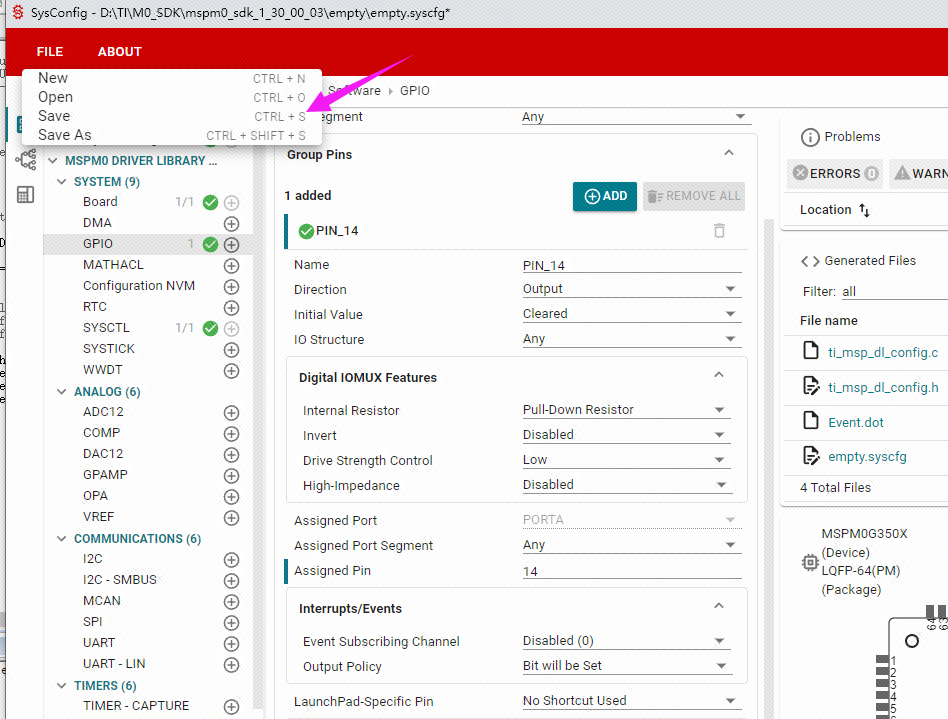

# MSPM0G3507-CMAKE-GCC-Template
这是一个MSPM0G3507的gcc cmake工程模板


# 根据本工程创建项目
1. 准备所需的文件
新建一个文件夹，例如：C:\MSPM0_workspace\my_project。

在该目录下创建子文件夹，最终文件夹结构如下所示：
```
my_project
├── Core  // 单片机核心文件
│   ├── main.c // 主函数入口
│   ├── ti_msp_dl_config.c // sysconfig生成的配置文件源文件
│   ├── ti_msp_dl_config.h // sysconfig生成的配置文件头文件
│   ├── startup_mspm0g350x_gcc.c // 启动程序
│   └── Project.syscfg // sysconfig生成的配置文件
├── Driver // 单片机驱动文件
│   ├── CMSIS // Cortex-M系列CPU驱动库
│   └── ti // 芯片相关驱动库
├── CMakeLists.txt // CMake配置文件
├── README.md // 说明文档
└── MSPM0L1306.lds // 链接脚本
```

* 1.1 MSPM0硬件驱动库
复制<SDK_PATH>/source/ti/driverlib文件夹到项目文件夹\Driver\ti。删除my_project\Driver\ti\driverlib\lib这个文件夹。

* 1.2 MSPM0设备标识文件
复制<SDK_PATH>/source/ti/devices文件夹到my_project\Driver\ti,  
复制my_project\Driver\ti\devices\msp\m0p\linker_files\gcc\里的MSPM0G3507.lds到my_project下，其他型号同理  
复制<SDK_PATH>\source\ti\devices\msp\m0p\startup_system_files\gcc\startup_mspm0g350x_gcc.c到my_project/Core下，其他型号同理


* 1.3 CMSIS
复制<SDK_PATH>/source/third_party/CMSIS/Core/到my_project\Driver\CMSIS\

* 1.4 主函数入口
复制<SDK_PATH>/examples/nortos/LP_MSPM0G3507/core/src/main.c到my_project\Core\src\main.c

* 1.5 sysconfig生成的配置文件
复制<SDK_PATH>/examples/nortos/LP_MSPM0L1306/core/src/ti_msp_dl_config.c到my_project\Core\src\ti_msp_dl_config.c


## 2. 配置工程
打开CMakeLists.txt，修改如下内容：
```cmake
# 设置项目名称和使用的语言（C和ASM）
project("my_project" C ASM)
# 设置构建类型为Debug
set (CMAKE_BUILD_TYPE         Debug)

# 设置编译器定义
set (PROJECT_DEFINES
	# LIST COMPILER DEFINITIONS HERE
	__MSPM0G3507__
)
# 添加所需源文件
file (GLOB PROJECT_SOURCES
    Core/*.c
    Driver/ti/driverlib/*.c
    Driver/ti/driverlib/m0p/*.c
    Driver/ti/driverlib/m0p/sysctl/*.c
)

# 设置包含目录 
set (PROJECT_INCLUDES
	# LIST INCLUDE DIRECTORIES HERE
    Core
    Driver/CMSIS/Core/Include
    Driver
)


# 设置链接脚本
## 注：这个路径是相对于CMakeLists.txt配置生成的build目录的路径，如果是相对于工程根目录，则为"../MSPM0L1306.lds"
set (LINKER_SCRIPT            "../MSPM0L1306.lds")

```

## 3. 生成工程
在命令行中进入工程目录，执行如下命令：
```
cmake -DCMAKE_BUILD_TYPE:STRING=Debug -DCMAKE_EXPORT_COMPILE_COMMANDS:BOOL=TRUE  -SMSPM0L1306-CMAKE-GCC-Template -BMSPM0L1306-CMAKE-GCC-Template/build -G Ninja
```


## 4. 编译工程
```
cmake --build build --config Debug --target all
```


## 5. 烧写程序
将编译生成的my_project.elf烧写到单片机中运行。
使用openocd
```
cd build
openocd -f interface/cmsis-dap.cfg -f target/ti_mspm0.cfg -c "program empty.elf verify reset exit"
```

# 闪灯

在sysconfig中，左侧可以选择MCU的外设，我们找到并点击GPIO选项卡，在GPIO中点击ADD，就可以添加一组GPIO



设置GPIO的参数。



>参数说明  
`Name` ：GPIO实例的自定义名称。默认情况下，名称从数字后缀“0”开始；不过，我们可自定义名称以反映模块用途（例如，将 GPIO 命名为“LED1”，这样我们就知道这个引脚是专门用于控制LED）。  
`Port` ：GPIO实例在所在端口。LED是接到了GPIOA14引脚，只能选择GPIOA。  
`Port Segment` ：设置端口上下拉电阻。注意是端口上下拉，是设置整个GPIOA端口。

3.5.3 设置引脚参数
设置引脚为输出模式，设置引脚默认输出低电平，设置引脚为下拉模式，设置引脚为GPIOA_14引脚，不开启中断事件。



>参数说明  
`Name`：为用户自定义的引脚名称，为了见名知意这里直接根据引脚号进行设置，设置为PIN_14。  
`Direction`：设置引脚模式或者说设置方向，有两个选项，输入和输出。这里我们是控制灯，选择为输出模式。
  
`Initial Value`：设置引脚的初始状态，只有在配置为输出模式时才可以设置。有两个选项，清除和置位。清除即输出低电平，置位即输出高电平。  
  
`IO Structure`：设置IO结构。有多个选项，默认(Any)、标准(Standard)、唤醒(Standard with Wake)、高速(High-Speed)以及可以容忍5V(5V Tolerant Open Drain)的结构。  
  
`Internal Resistor`：设置引脚的上下拉电阻。有三个选项，不设置、设置上拉和设置下拉电阻。这里根据LED灯的接法，选择了下拉电阻。  
  
`Assigned Pin`：设置引脚号。要控制哪一个引脚就填写对应的引脚号，比如开发板中的LED是接到了GPIOA14，那么就填入14。

将之前在SYSCONFIG中的配置保存。



到这里还没有结束，我们还需要确认.c和.h文件是否更新。我们直接编译，编译后就会自动的更新到Keil中。如果没有更新，我们将sysconfig中的文件的内容复制过来。在sysconfig中打开配置的.C文件。

## 控制引脚状态
在dl_gpio.h库函数文件中，有三个函数可以控制引脚状态。

## 相关函数说明
```c
__STATIC_INLINE void DL_GPIO_setPins(GPIO_Regs* gpio, uint32_t pins)

//该函数为控制引脚输出高电平，按照本例程中LED的引脚，则可以写为 DL_GPIO_setPins(LED1_PORT,LED1_PIN_14_PIN);

__STATIC_INLINE void DL_GPIO_clearPins(GPIO_Regs* gpio, uint32_t pins)

//该函数为控制引脚输出低电平，按照本例程中LED的引脚，则可以写为 DL_GPIO_clearPins(LED1_PORT,LED1_PIN_14_PIN);

__STATIC_INLINE void DL_GPIO_togglePins(GPIO_Regs* gpio, uint32_t pins)

//该函数为控制引脚的电平翻转，如果原来是高电平则变为低电平，如果原来是低电平则变为高电平。按照本例程中LED的引脚，则可以写为DL_GPIO_togglePins(LED1_PORT,LED1_PIN_14_PIN);
```
在empty.c中，输入以下代码：

```c
#include "ti_msp_dl_config.h"

//自定义延时（不精确）
void delay_ms(unsigned int ms)
{
    unsigned int i, j;
    // 下面的嵌套循环的次数是根据主控频率和编译器生成的指令周期大致计算出来的，
    // 需要通过实际测试调整来达到所需的延时。
    for (i = 0; i < ms; i++)
    {
        for (j = 0; j < 8000; j++)
        {
            // 仅执行一个足够简单以致于可以预测其执行时间的操作
            __asm__("nop"); // "nop" 代表“无操作”，在大多数架构中，这会消耗一个或几个时钟周期
        }
    }
}

int main(void)
{
    SYSCFG_DL_init();
    while (1)
    {
        DL_GPIO_clearPins(LED1_PORT,LED1_PIN_14_PIN);//输出低电平
        delay_ms(1000);//延时大概1S
        DL_GPIO_setPins(LED1_PORT,LED1_PIN_14_PIN);  //输出高电平
        delay_ms(1000);//延时大概1S
    }
}
```
## 代码扩展

`asm("nop");` 是一个内联汇编指令，表示“无操作”（NOP）。它用来确保循环内有一定的延时。

编译下载就可以看到开发板上的A14这个灯开始缓慢闪烁了。