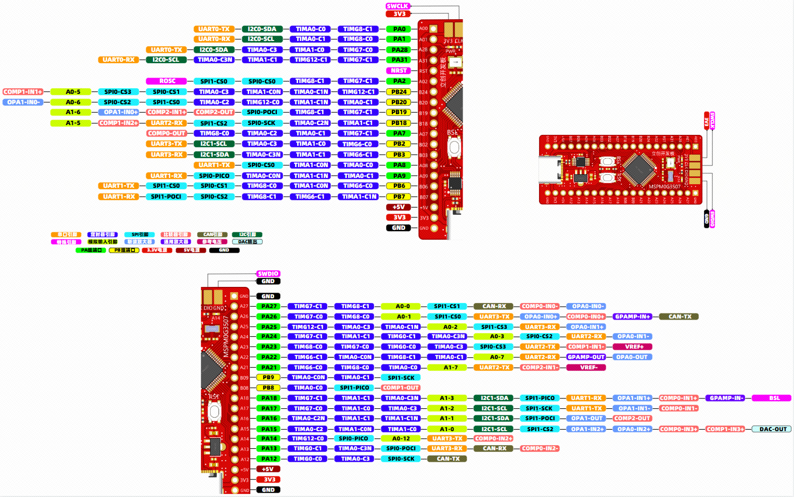
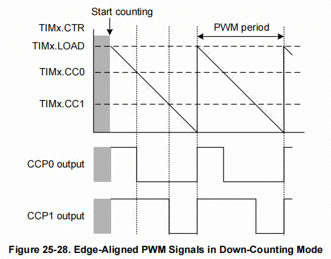
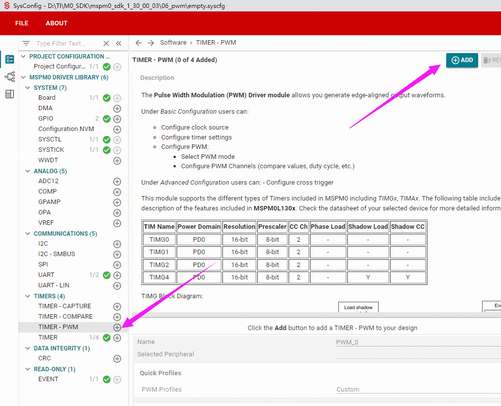
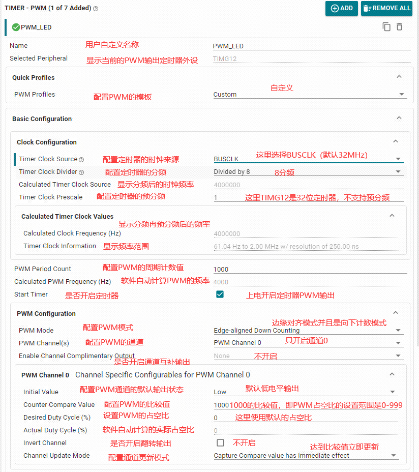
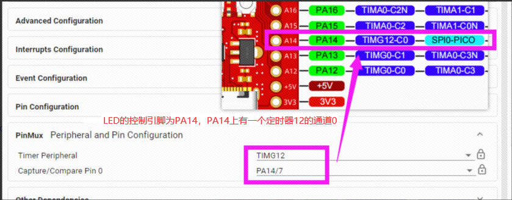
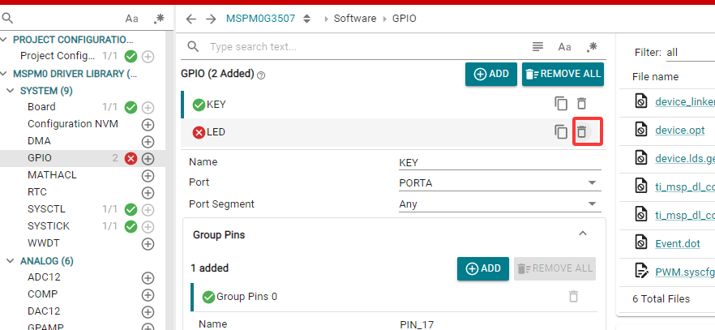

# PWM输出

## PWM介绍

PWM（Pulse Width Modulation 脉宽调制）是利用微处理器的数字输出来对模拟电路进行控制的一种非常有效的技术。它是一种对模拟信号电平进行数字编码的方法。是指在一定时间内波形的高电平（即 1 状态）所占用的时间比例。通过高分辨率计数器的使用，方波占空比被调制用来对一个模拟信号的电平进行编码。PWM 信号任然是数字的，因为在给定的任何时刻，满幅值的直流供电要么完全有，要么完全无。比如我们的电压输出是 5V的，那么经过改变 PWM 的占空比，可以达到在一定时间内输出 3.3V 或者 1.3V 的效果。

举个例子

想象你有一个LED和一个开关，你以肉眼看不清的速度，快速反复地开关一次，这样LED灯就会亮一半时间，暗一半时间。如果你快速地进行这个操作，对于观察者来说，LED就像是以半亮度持续亮着。这就是PWM的基本原理。

如果你把大部分时间保持开关为关闭状态，那么LED会显得更暗；相反，如果你把开关大部分时间保持为打开状态，LED会显得更亮。这就是PWM调节占空比来控制亮度的过程。

MSPM0G系列PWM介绍

前面我们介绍了MSPM0G系列一共有7个定时器，可以分为2种类型，通用计时器（TIMG）和高级控制计时器（TIMA）。而PWM功能就是在定时器的基础上实现的。从用户手册上可以了解到，MSPM0G3507有7个定时器，哪一个定时器具有PWM功能需要参考数据手册的引脚说明，每一个PWM通道都对应单片机的一个管脚，这个引脚不是唯一固定的，可能有一个或者两个管脚都对应同一个通道。比如说TIMG_C0对应PA5和PA12，就是说PA5和PA12管脚都可以配置为定时器的通道0，我们在使用的时候可以任选其一进行配置。



PWM一共有两种模式，一个是边缘对齐PWM，指的是定时器使用的向下计数模式，输出通道在定时器计数开始的时候会输出高电平， 当计数值与输出通道的比较值（图中的CC0和CCP0，CC1和CCP1）相同的时候， 输出通道会输出低电平，一直到定时器的计数值计数到0，就完成了一个周期的脉冲输出。



另一个模式是中心对齐模式，指的是定时器的上下计数模式，输出通道会在定时器开始的时候输出低电平，在定时器向上计数和向下计数两次到达输出通道的比较值相等的时候各翻转一次电平。

## PWM基本参数

PWM是脉冲宽度调制，具有两个非常重要的参数：频率和占空比。

频率：PWM的频率是整个周期的倒数。  
占空比：占空比是指一个周期内高电平所占的比例。  


## 控制方法
采样控制理论中有一个重要结论：冲量相等而形状不同的窄脉冲加在具有惯性的环节上时，其效果基本相同。PWM控制技术就是以该结论为理论基础，对半导体开关器件的导通和关断进行控制，使输出端得到一系列幅值相等而宽度不相等的脉冲，用这些脉冲来代替正弦波或其他所需要的波形。按一定的规则对各脉冲的宽度进行调制，即可改变逆变电路输出电压的大小，也可改变输出频率。

控制方式就是对逆变电路开关器件的通断进行控制，使输出端得到一系列幅值相等但宽度不一致的脉冲，用这些脉冲来代替正弦波或所需要的波形。也就是在输出波形的半个周期中产生多个脉冲，使个脉冲的等值电压为正弦波形，所获得的输出平滑且低次谐波少。按一定的规则对各脉冲的宽度进行调制，即可改变逆变电路输出电压的大小，也可改变输出频率。


## PWM优点

PWM的一个优点是从处理器到被控制系统信号都是数字形式，无需进行数模转换。让信号保持为数字形式可将噪声影响降到最小。噪声只有在强到足以将逻辑1改变为逻辑0或将逻辑0改变为逻辑1时，才能对数字信号产生影响。对噪声抵抗能力的增强是PWM相对于模拟控制的另一个优点，而且这也是在某些时候将PWM用于通信的主要原因。

## PWM应用

PWM可应用于电机调速、功率调制、PID调节、通信等，配置简单、抗干扰能力强。可以通过PWM来控制LED灯的亮暗变化，可以通过PWM信号来控制无源蜂鸣器发出简单的声音以及实现功率继电器的线圈节能等。PWM用来驱动电机和调节电机转速是非常重要的内容。

## PWM配置

通过驱动PWM实现一个呼吸灯的效果，通过PWM信号占空比的变化，可以实现流过LED电流的不同，实现LED亮暗的渐变。一般人眼睛对于80HZ以上刷新频率则完全没有闪烁感，由于频率很高时看不到闪烁，占空比越大LED越亮，占空比越小LED越暗。所以在频率一定时，可以用不同占空比改变LED灯的亮度，使其达到一个呼吸灯的效果。本案例将使用板载的LED灯（PA14）实现呼吸灯效果，逐渐亮再逐渐灭。

在sysconfig中，左侧可以选择MCU的外设，我们找到并点击TIMER-PWM选项卡，在TIMER-PWM中点击ADD，就可以添加定时器下的PWM外设。



### PWM参数的配置

这里设置通道0为100Hz的频率，0%占空比的PWM，周期计数值为1000，比较值也设置为1000，这样的话从1000开始向下计数，每遇到一次1000，PWM的状态就翻转一次。



引脚的设置。



这里我们已经将LED的PA14引脚给PWM占用了，不能再用于GPIO外设上，需要去除。目前例程中GPIO外设仅剩余一个按键的配置。



将以上配置保存，然后编译更新。

## PWM呼吸灯实验

```c
#include "ti_msp_dl_config.h"

volatile unsigned int delay_times = 0;

//搭配滴答定时器的精准毫秒级延时
void delay_ms(unsigned int ms)
{
    delay_times = ms;
    while( delay_times != 0 );
}

int main(void)
{
    int i = 0;

    SYSCFG_DL_init();

    while (1)
    {

        // 呼吸灯渐亮过程
        for (i = 0; i <= 999; i++)
        {
            // 设置 LED 亮度
            DL_TimerG_setCaptureCompareValue(PWM_LED_INST,i,GPIO_PWM_LED_C0_IDX);
            delay_ms(1);  // 延迟以控制亮度变化速度
        }
        // 呼吸灯渐暗过程
        for (i = 999; i > 0; i--)
        {
            // 设置 LED 亮度
            DL_TimerG_setCaptureCompareValue(PWM_LED_INST,i,GPIO_PWM_LED_C0_IDX);
            delay_ms(1);  // 延迟以控制亮度变化速度
        }
    }
}

//滴答定时器的中断服务函数
void SysTick_Handler(void)
{
    if( delay_times != 0 )
    {
        delay_times--;
    }
}
```

将以上代码烧录到开发板中运行，即可看到开发板上的LED会渐灭再渐亮。

相关代码解析。

可以通过函数 DL_TimerG_setCaptureCompareValue 设置定时器PWM的比较值，通过修改比较值看可以实现修改PWM的占空比。
为什么for循环中i的范围是0-999？因为我们设置的PWM的周期是计数1000个值，所以我们的比较值只能在0-999。