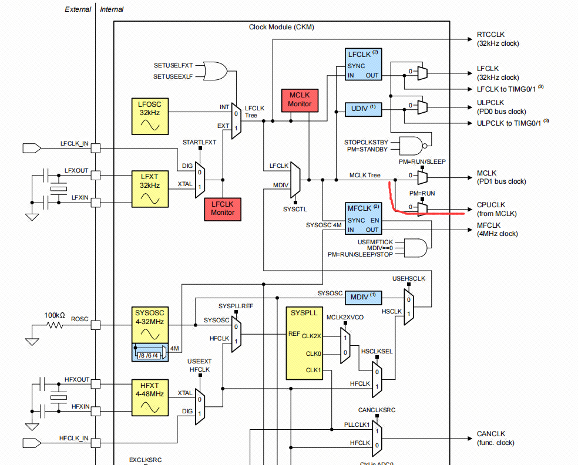
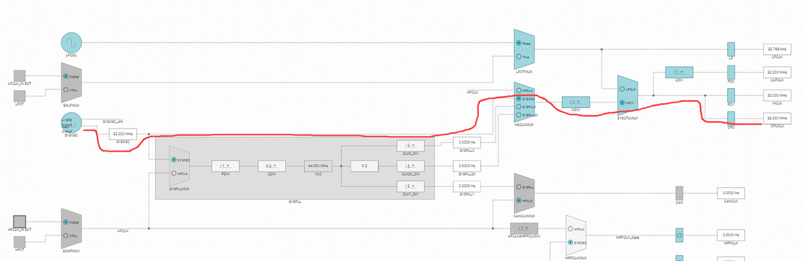
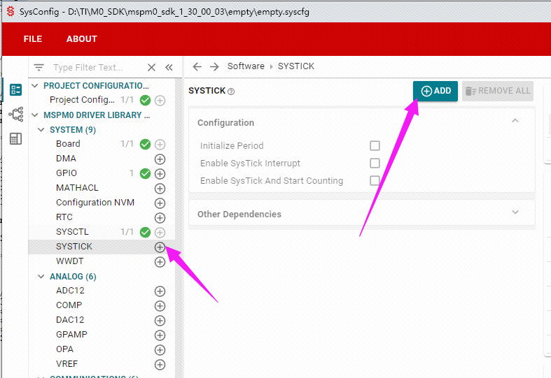
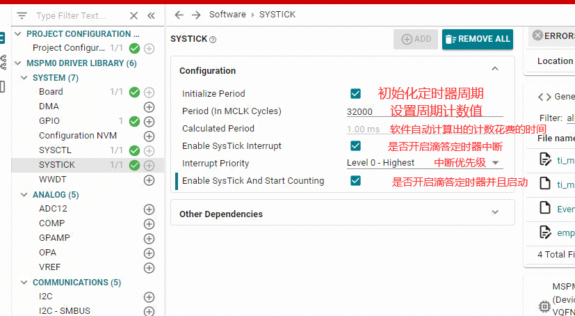
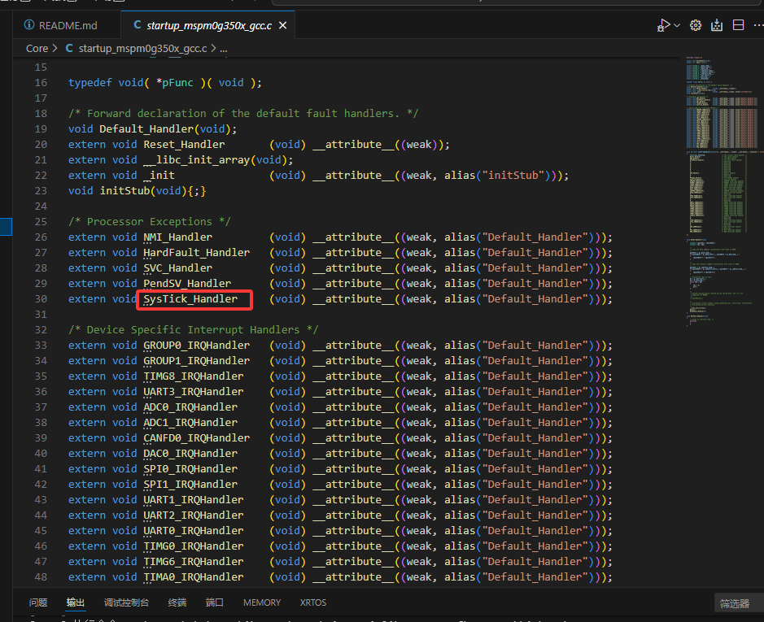

# 系统延时

延时功能在计算机编程中十分常见，它可以暂停程序的执行一段时间，以实现各种应用需求。

## 延时的作用

在MSPM0或其他微控制器的编程中，延时被广泛使用，主要有以下一些原因：

处理硬件：许多硬件都需要一些时间来响应某个命令。例如，如果在一个程序中你启动一个电动机然后立即检查其状态，你可能会得到一个错误的读数，因为电动机可能还没有足够的时间开始旋转。此时你需要使用 delay() 函数让系统等待一段时间，使得电动机有足够的时间响应。
用户交互：我们常常需要在用户交互中实现延迟效果。例如，在蜂鸣器播放音乐时，音符之间需要一段沉默的时间。或者，在闪烁LED灯的情况下，"开"和"关"状态之间需要延时以控制闪烁的速度。
节省能源：在一些应用中，比如电池供电的系统，如果不在需要的时候长期保持系统的高速运转，那么电池的寿命会大大缩短。在此情况下，我们可以让系统在一段时间后进入待机或低功耗模式，直到下一个处理周期到来。
定时操作：在许多项目中，我们常常需要实现一些特定时间点的操作。例如，在自动灌溉系统中，我们可能需要在每天的特定时间点进行灌溉。在间隔测量中，我们可能每隔一段时间采集一次数据。
尽管延时函数在很多情况下非常有用，但也需要注意其阻塞性质。过度依赖阻塞延时可能会导致程序对其他事件的响应不及时。为了更好的在MSPM0上进行多任务编程，我们还可以学习一些非阻塞延时的编程技术。

> ❓什么是阻塞延时？

  阻塞延时是在程序执行过程中，当某个操作或函数需要一定时间才能完成时，程序会暂停执行直至该操作完成，这段时间程序被阻塞了。阻塞延时可能会导致程序运行速度变慢或出现假死现象。 举个例子，假设你想要煮开水来泡茶。通常情况下，你会将水壶放在炉灶上加热，等待水烧开后才能使用。在这个过程中，存在阻塞延时。 当你将水壶放在火上时，程序可以看作是“等待”水烧开的操作。在这个等待过程中，你不能立即得到热水来泡茶，需要耐心等待水煮沸。期间，你可能无法做其他与烧水无关的事情，因为你需要留意水壶，并等待时机。即便家里着火了，你也还是在等待烧水。

## 滴答定时器介绍

  SysTick定时器可用作标准的下行计数器，是一个24位向下计数器，有自动重新装载能力，可屏蔽系统中断发生器。Cortex-M0处理器内部包含了一个简单的定时器，所有基于M0内核的控制器都带有SysTick定时器,这样就方便了程序在不同的器件之间的移植。SysTick定时器可用于操作系统，提供系统必要的时钟节拍，为操作系统的任务调度提供一个有节奏的“心跳”。正因为所有的M0内核的芯片都有Systick定时器，这在移植的时候不像普通定时器那样难以移植。

  RCU 通过 MCLK 作为 Cortex 系统定时器（SysTick）的外部时钟，即使用MCLK计时，MCLK默认为32MHz。通过对 SysTick 控制和状态寄存器的设置，即可控制或读取。关于系统时钟的介绍可参考用户手册的第128页。





SysTick定时器设定初值并使能之后，每经过1个系统时钟周期，计数值就减1，减到0时，SysTick计数器自动重新装载初值并继续计数，同时内部的COUNTFLAG标志位被置位，触发中断（前提开启中断）。

## 滴答定时器配置

### 开启SYSCONFIG配置工具

在sysconfig中，左侧可以选择MCU的外设，我们找到并点击SYSTICK选项卡，在SYSTICK中点击ADD，就可以添加滴答定时器。



### 配置滴答定时器

滴答定时器是使用MCLK计时，而MCLK为32MHz，及每计一次数花费的时间为 1÷32,000,000 = 0.00000003125 S. 假设我们设置要计数的值为32000，则计32000个数会花费的时间为：32000 x 0.00000003125 = 0.001 S = 1MS. 所以如果我们要设置1ms的滴答定时器就设置滴答定时器的计数值为32000。案例中我们开启了中断，关于中断的概念在后面再说。大概的意思就是中断其他任务，先执行滴答定时器的内容。


将以上配置保存，编译。

## 滴答定时器使用

我们配置好了滴答定时器之后，还要手动编写滴答定时器的中断服务函数，因为我们开启的滴答定时器的中断，当滴答定时器的计数值从我们设置的值减到0时，就会触发一次中断，触发中断就会执行中断服务函数。各个中断的中断服务函数名称已经被写死，不可修改，否则无法正常进入中断服务函数。关于中断服务函数的名称是什么，可以在工程的启动文件中找到各个中断的中断服务函数名称。



在empty.c文件中编写如下代码：

```c
#include "ti_msp_dl_config.h"

volatile unsigned int delay_times = 0;

//搭配滴答定时器实现的精确ms延时
void delay_ms(unsigned int ms)
{
    delay_times = ms;
    while( delay_times != 0 );
}

int main(void)
{
    SYSCFG_DL_init();

    while (1)
    {

    }
}

//滴答定时器中断服务函数
void SysTick_Handler(void)
{
    if( delay_times != 0 )
    {
        delay_times--;
    }
}
```

> 🔅C语言扩展  
在C语言中，`volatile` 是一个关键字，用来告诉编译器不要对它所修饰的变量做任何优化，因为这个变量的值可能会随时被意想不到的因素改变，比如硬件中断、多线程操作等。volatile 告诉编译器不要将对这个变量的读写操作优化掉，每次访问都要从变量地址中读取或写入。在多线程或与硬件相关的编程中，volatile 经常用来声明那些程序之外其他实体可能会修改的变量，以确保每次访问都能获取最新的值，避免编译器优化导致的意想不到的问题。

以上代码中执行的逻辑为：开启了滴答定时器后，滴答定时器每隔1ms进入中断服务函数中，中断服务函数里一直判断变量 delay_times是否不为0，当不为0时将会一直自减到0。delay_ms()函数的执行效果就是改变变量delay_times的值，让它不为0，然后死等到变量delay_times为0则结束。因为有中断在不断的以1ms的时间间隔将变量delay_times 自减到0，这样我们的精确延时函数就写好了。

## LED灯闪烁实验

前面我们学习了如何去使用滴答定时器，下面我们就用滴答定时器的延时去实现LED闪烁1s间隔。其实很简单就是先让LED引脚输出高电平，然后调用delay_1ms(1000),再让LED引脚输出低电平，再调用delay_1ms(1000)，最后在while(1)函数里调用即可。

```c
#include "ti_msp_dl_config.h"

volatile unsigned int delay_times = 0;

//搭配滴答定时器实现的精确ms延时
void delay_ms(unsigned int ms)
{
        delay_times = ms;
        while( delay_times != 0 );
}

int main(void)
{

    SYSCFG_DL_init();

    while (1)
    {
        //LED引脚输出高电平
        DL_GPIO_setPins(LED1_PORT, LED1_PIN_14_PIN);
        delay_ms(1000);
        //LED引脚输出低电平
        DL_GPIO_clearPins(LED1_PORT, LED1_PIN_14_PIN);
        delay_ms(1000);
    }
}

void SysTick_Handler(void)
{
        if( delay_times != 0 )
        {
                delay_times--;
        }
}
```

烧写我们的代码之后，可以看到开发板LED将会1s亮1s灭。

