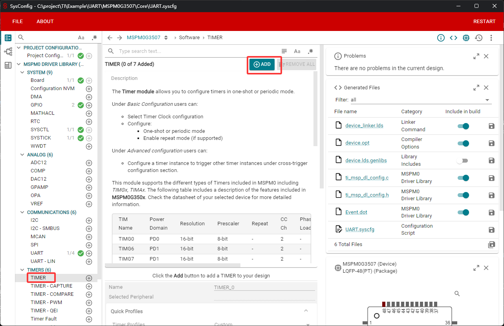

# 定时器

## 什么是定时器

定时器是单片机内部集成，可以通过编程控制。单片机的定时功能是通过计数来实现的，当单片机每一个机器周期产生一个脉冲时，计数器就加一。定时器的主要功能是用来计时，时间到达之后可以产生中断，提醒计时时间到，然后可以在中断函数中去执行功能。比如我们想让一个led灯1秒钟翻转一次，就可以使用定时器配置为1秒钟触发中断，然后在中断函数中执行led翻转的程序。

## MSPM0G系列定时器

MSPM0G系列一共有7个定时器，可以分为2种类型，通用计时器（TIMG）和高级控制计时器（TIMA）。不同类型的定时器所拥有的功能数量不同，一般高级定时器的功能最多，通用定时器次之。具体功能对照可以查看用户手册的第1436页。


## 高级控制定时器

TIMA模块由一个16位自动重载计数器组成，由可编程预调节器驱动，最多四个捕获/比较（CC）块用于多个捕获/比较，带死区插入的PWM输出和间隔定时。TIMA具有广泛的事件生成功能，它们来自不同的计数器事件，如溢出、重载，以及来自每个捕获/比较寄存器。它还具有硬件设计来处理由内部或外部电路产生的故障信号，以指示系统中的故障。

关于更多高级定时器的功能描述可以查看用户手册的第1359页，需要注意的是开发板的主控为MSPM0G3507。

## 通用定时器

TIMG模块由16位和32位自动重新加载计数器组成，由可编程预计算器驱动，具有两个捕获/比较（CC）块，用于多个捕获/比较、PWM输出和间隔定时。TIMG还具有广泛的事件生成功能，包括计数器溢出、重加载和针对各种用例的捕获/比较操作。

关于更多通用定时器的功能描述可以查看用户手册的第1358页，需要注意的是开发板的主控为MSPM0G3507。

## 定时器基本参数

### 预分频

预分频器可以将定时器的时钟(TIMCLK)频率按1到256之间的任意值分频（1到256是基于定时器分频器是8位），TIMG可以选择BUSCLK、MFCLK、LFCLK作为时钟源，可以最大8分频时钟，再经过一个8位的预分频器，最终称为定时器的计数时钟。


### 向上或向下计数模式

向上计数指的是计数器从0开始向上连续计数到自动加载值，一旦计数器计数到自动加载值，会重新从0开始向上计数并产生上溢事件。 向下计数指的是计数器从自动加载值开始向下连续计数到0，一旦计数器计数到0，会重新从自动加载值开始向下计数并产生下溢事件。

### 更新事件

更新事件是当计数器上溢或者下溢而开始新的计数周期时触发的。更新事件可以触发DMA请求，以用于在下一个计数周期开始时及时更新定时器的运行参数，特别适合用于实时控制。

## 定时器的配置

如果项目中需要定时执行或者需要重复执行一定的工作， 定时器的使用尤为重要。在下一段内容将会介绍如何去配置定时器，定时1秒钟进入一次中断，然后在定时器中断服务函数中实现1秒钟led电平状态翻转1次。最后实现的效果就是led亮1秒钟灭1秒钟。

在sysconfig中，左侧可以选择MCU的外设，我们找到并点击TIMER选项卡，在TIMER中点击ADD，就可以添加定时器外设。



### 定时器参数的配置
配置定时器的时钟、分频、周期以及中断等参数。


本例程中的实际参数如下： 定时器时钟选择BUSCLK-32MHz，进行8分频，再100预分频，得到定时器的频率为40KHz。设置定时器周期为1S，周期向下计数模式，开启0溢出中断。


LED的GPIO配置是按照的LED灯章节进行配置，未有改动。

将以上配置保存，然后编译更新。

## 定时器灯闪烁实验

在empty.c（要main函数的文件）中编写如下代码：
```c
#include "ti_msp_dl_config.h"

int main(void)
{
    SYSCFG_DL_init();
    //清除定时器中断标志
    NVIC_ClearPendingIRQ(TIMER_0_INST_INT_IRQN);
    //使能定时器中断
    NVIC_EnableIRQ(TIMER_0_INST_INT_IRQN);

    while (1)
    {

    }
}

//定时器的中断服务函数 已配置为1秒的周期
void TIMER_0_INST_IRQHandler(void)
{
    //如果产生了定时器中断
    switch( DL_TimerG_getPendingInterrupt(TIMER_0_INST) )
    {
        case DL_TIMER_IIDX_ZERO://如果是0溢出中断
            //将LED灯的状态翻转
            DL_GPIO_togglePins(LED1_PORT, LED1_PIN_14_PIN);
            break;

        default://其他的定时器中断
            break;
    }
}
```