# 串口通信

## 串口通信介绍

串口是指外设和处理器之间通过数据信号线、地线和控制线等，按位进行传输数据的一种通讯方式。尽管传输速度比并行传输低。但串口可以在使用一根线发送数据的同时用另一根线接收数据。 这种通信方式使用的数据线少，在远距离通信中可以节约通信成本。串口通信最重要的参数是波特率、数据位、停止位和奇偶校验位，这些参数在两个通信端口之间必须一致。

## 串口通信参数介绍

串口通信参数包括波特率（Baud Rate）、数据位（Data Bits）、校验位（Parity Bits）、停止位（Stop Bits）等。这些参数描述了传输数据的基本规格。例如，波特率定义了数据传输的速率，数据位确定每个数据字节中包含的位数，校验位用于数据的差错检测，停止位表示数据传输结束的标志等。

波特率：衡量通信速度的参数，它表示每秒钟传送的 bit 的个数。  
数据位：衡量通信中实际数据位的参数，表示一个信息包里包含的数据位的个数。  
停止位：用于表示单个信息包的最后位，典型值为 1、1.5 和 2 位。由于数据是在传输线上传输的，每个设备都有自己的时钟，很有可能在通信过程中出现不同步，停止位不仅仅表示传输的结束，还能提供校正时钟同步的机会。停止位的位数越多，不同时钟同步的容忍程度越大，但是数据传输率也越慢。    
奇偶检验位：表示一种简单的检查错误的方式。  
关于更为详细的介绍请搜索百度。

## 串口工作模式

串口工作模式分为三种：单工、全双工模式和半双工模式。

单工：在通信的任意时刻，信息只能由 A 传到 B，或B传到A；  
半双工：在通信的任意时刻，信息即可由 A 传到 B，又能由 B 传到 A，但同时只能有一个方向上的传输存在；  
全双工：在通信的任意时刻，通信线路上存在 A 到 B 和 B 到 A 的双向信号传输；

## 串口通信协议

串口通信协议定义了在串口上进行数据交换的规则和格式。常见的串口通信协议包括ASCII协议、Modbus协议、RS-232协议等。协议规定了数据的帧结构、数据格式、校验方式等，确保发送和接收双方按照相同的规则进行数据交换，从而实现数据的正确传输和解析。

串口通信是一位一位地传输，每传输一个字符总是以起始位开始，以停止位结束，字符之间没有固定的时间间隔要求。每一个字符的前面都有一位起始位（低电平），后面由 7 位数据位组成，接着是一位校验位，最后是停止位。停止位后面是不定长的空闲位，停止位和空闲位都规定为高电平。

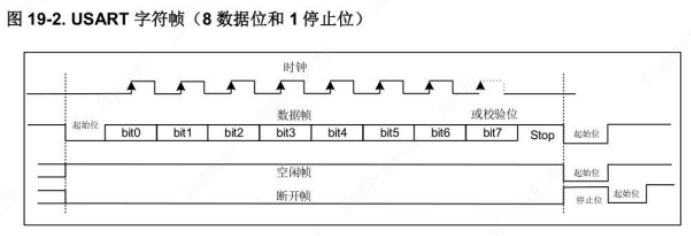

## 串口通信的作用及优势

串口是计算机和外部设备之间最常见的通信接口之一，具有重要的作用和广泛的应用。在计算机领域，串口的重要性体现在以下几个方面：

数据传输：串口是一种常用的数据传输接口。通过串口，计算机可以与各种外部设备进行数据交换和通信。无论是传感器、执行器、显示器、打印机还是其他外部设备，串口通信都可以实现数据的传输和控制。  
远程控制和监控：串口通信被广泛应用于远程控制和监控领域。通过串口，计算机可以远程控制设备的动作，并实时监测设备的状态和数据信息。这在工业控制、自动化系统、远程监控等场景中具有重要的作用。  
调试和故障排查：串口通信是调试和故障排查的重要工具。通过串口，计算机可以与嵌入式系统、单片机等进行通信，实时监控和调试程序，输出调试信息，进行错误定位和排查，并对系统进行状态监测和故障诊断。  
硬件连接：串口可以作为计算机与各种外部设备之间的连接桥梁。通过串口，可以连接和控制各类外部设备，如传感器、执行器、外围设备等。串口能够提供稳定的数据传输和双向通信功能。    
通信协议：串口通信协议是计算机与外部设备之间数据传输的规范和约定。通过定义不同的协议，可以实现不同设备之间的数据交互和通信。常见的串口通信协议有UART、RS-232、RS-485等。


总之，串口对于计算机和外部设备之间的通信具有重要的作用。它是数据传输、远程控制和监控、调试和故障排查的关键工具，是计算机与外部设备连接和通信的桥梁。通过串口通信，可以实现与各种外部设备的数据交互，提高系统的功能和性能。具体到串口通信的作用和优势，可以总结如下：

数据传输：串口通信可以实现双向数据的可靠传输，包括发送和接收各种类型的数据。  
远程控制和监控：通过串口通信，可以实现远程控制设备的动作，并实时监测设备的状态和数据信息。  
调试和故障排查：串口通信是调试和故障排查的重要工具，可以实时监控和调试程序，输出调试信息，进行错误定位和排查。  
灵活性和实时性：串口通信具有较高的灵活性和实时性，可以根据需求调整波特率和参数，并及时处理数据和响应外部事件。  
成本效益：串口通信使用简单、成本低廉的硬件，并且广泛应用于各个领域，是一种经济实用的通信方式。  
总之，串口通信在数据传输、远程控制与监控、调试和故障排查等方面具有重要的作用和诸多优势，是实现设备间数据交互和系统功能的重要手段。


## M0G350X系列的串口说明

开发板使用的是MSPM0G3507为主控，它只有四个串口可用，分别是UART0到UART3。并且其串口支持的功能非常丰富，根据数据手册中的说明支持的功能有如下表所示：


需要注意的是，不是所有的引脚都支持串口功能，只有特定的引脚才支持。这个需要大家去根据数据手册进行查找。也可以参考下方我们总结的外设引脚分布图。

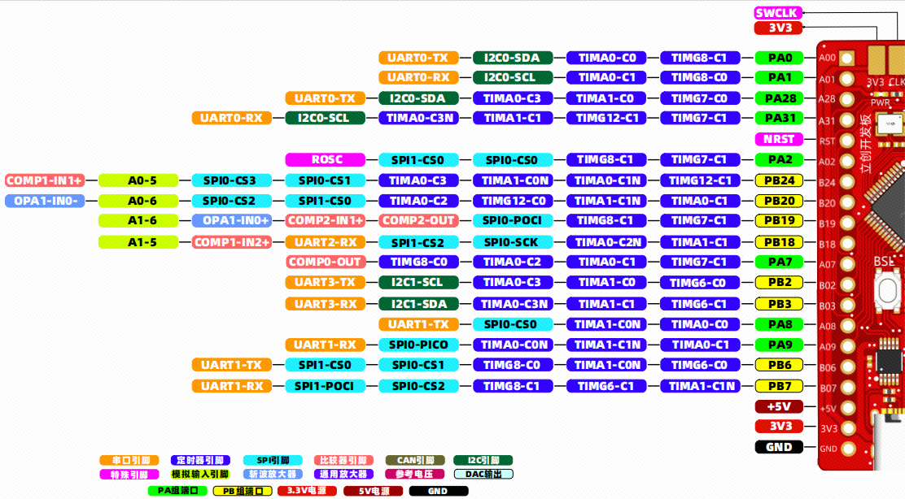

## 串口通信的硬件连接

在开发板上有集成了一块CH340E，CH340E 是一款流行的 USB 转串口芯片，广泛用于各种需要串口通信的设备中。它提供了一种低成本、便捷的方式将 USB 接口转换成标准的串口（RS232/RS485/TTL），广泛应用于单片机开发、嵌入式系统、通信设备等多个领域。在开发板上，我们可以通过一个数据线，接入到开发板的TYPE-C接口上，即可与开发板进行串口通信。 而CH340E接入到了PA10与PA11引脚。

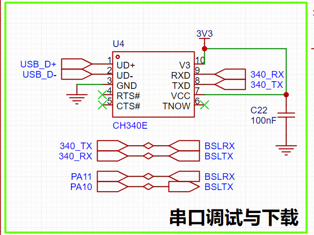

PA10与PA11引脚为G3507的串口0引脚。

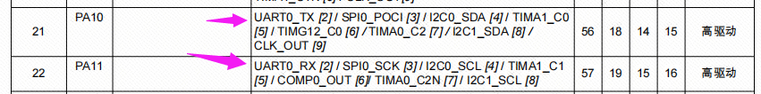

## 串口通信的配置

本案例将使用PA10和PA11引脚上的UART0外设，搭配开发板板载的CH340这个USB转串口芯片，实现接收上位机（电脑）发送过来的串口数据，再通过串口发送功能将数据发送给上位机（电脑）的操作。

### 串口时钟的配置

这里需要介绍一下串口的时钟来源，串口的时钟来源一共有三个，分别是：

>时钟来源  
`BUSCLK`：由内部高频振荡器提供的CPU时钟，通常芯片出厂时设置为了32MHz。  
`MFCLK`：只能使用固定的4MHz时钟(参考用户手册132页)。开启的话需要配置时钟树的SYSOSC_4M分支，才能够正常开启。  
`LFCLK`：由内部的低频振荡器提供时钟（32KHz）。在运行、睡眠、停止和待机模式下有效，使用该时钟可以实现更低的功耗。  

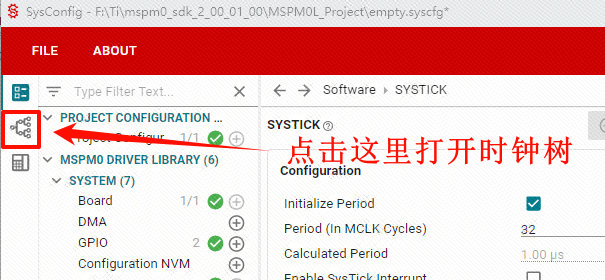

在时钟树中打开MFCLK的开关。
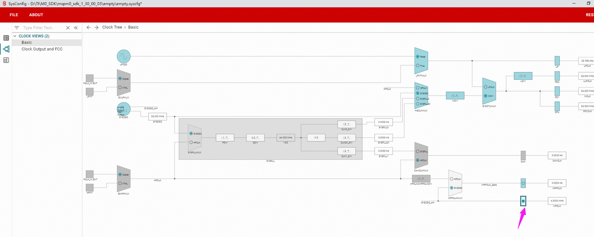

本案例使用的是MFCLK作为串口的时钟来源，开启MFCLK需要在sysconfig中配置时钟树。在sysconfig左侧的选项卡中找到SYSCTL选项，在选项页中找到 Use Clock Tree 进行打勾，以开启时钟树的配置。

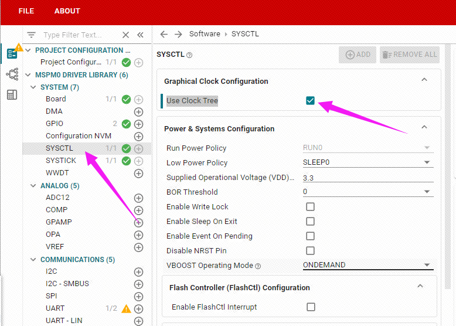

开启之后，我们在最左侧的三个选中，选择中间的时钟树配置选项。

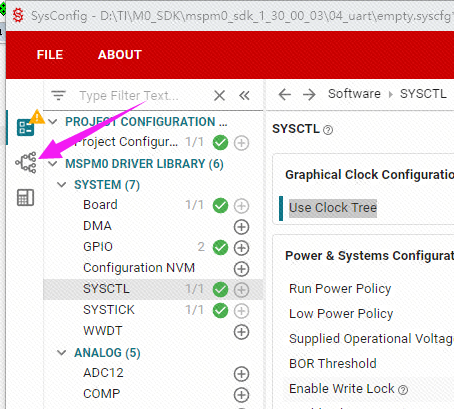

点击SYSOSC_4M分支上的选项块，开启MFCLK时钟。当右侧出现4.0000Mhz时说明设置完成。


### 配置串口参数

在sysconfig中，左侧可以选择MCU的外设，我们找到并点击UART选项卡，在UART中点击ADD，就可以添加串口外设。

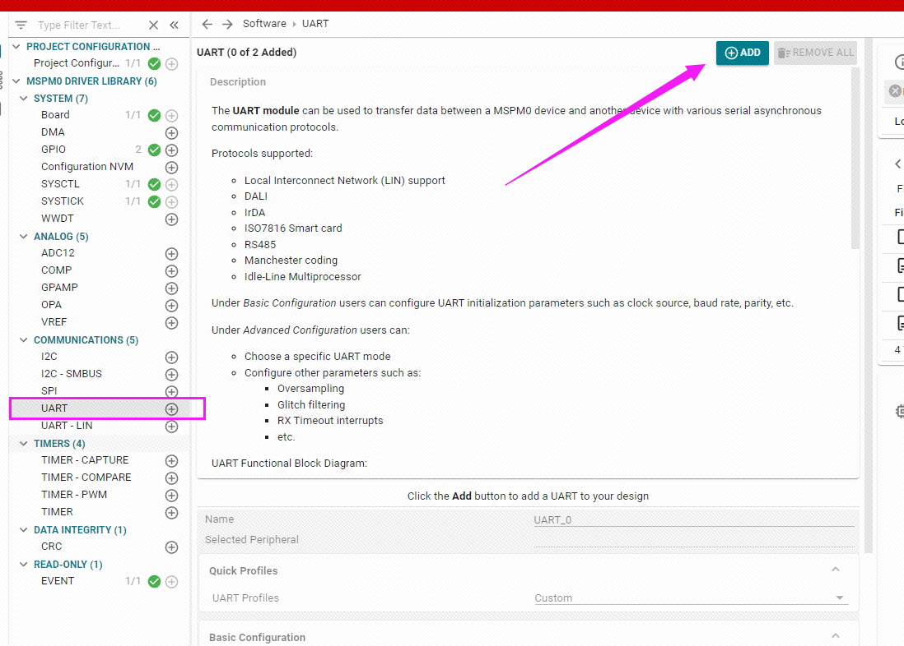

配置串口的参数。

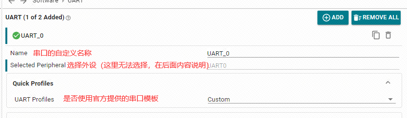

> 说明  
上图中的串口模板，官方一共提供了3种模板，这里大家自行查阅，用的不多所以不再说明。

串口的基本配置。这里使用的是波特率为9600、数据位8位、停止位1位、校验位无、不使用硬件流控制的配置。

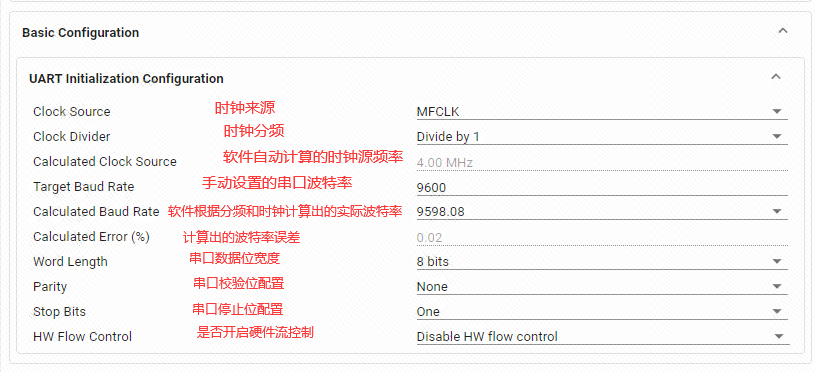

串口的高级配置。这里我们使用默认选项。需要注意的是采样周期Oversampling，采样周期的选择有3、8、16等三个档，通常选择3和8即可，如果时钟偏差较大或者时钟速度太快导致波特率分频的系数计算异常，就选择16档。只要不要让sysconfig报错即可。 这里我们的串口时钟频率是4MHz，所以我们选择16档。

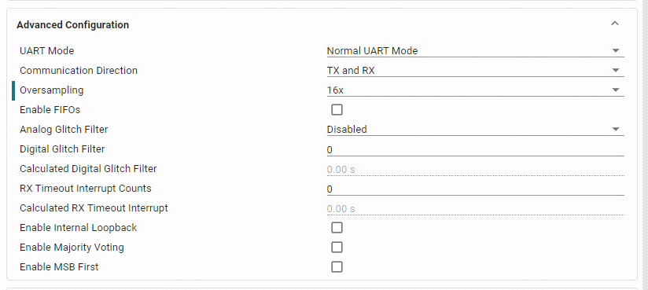

串口中断的配置。本案例使用中断方式的串口接收，每当接收到一个字节将会进入到接收中断中。

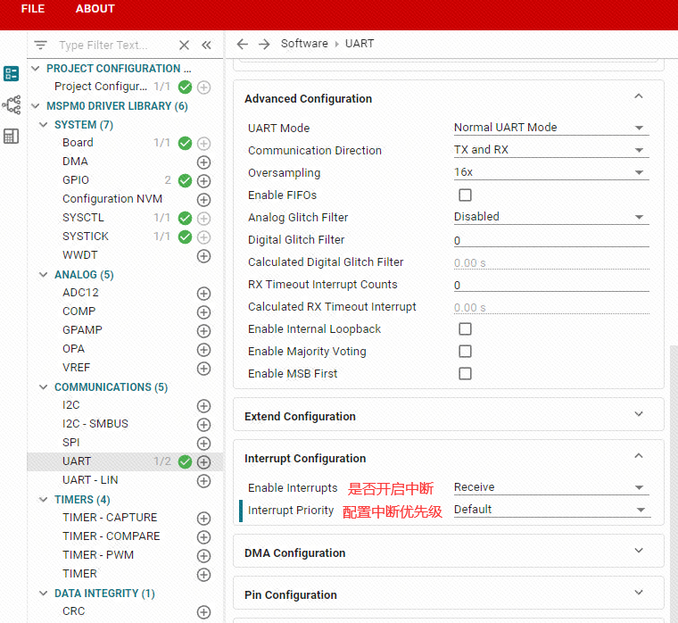

设置串口的引脚。根据数据手册上的引脚说明，可以知道PA10和PA11是串口0。

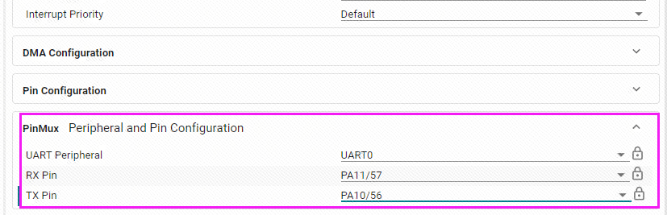

将以上配置保存,编译更新。

## 串口收发实验

我们配置好了串口之后，还要手动编写串口的中断服务函数，因为我们开启了串口的接收中断，当串口接收到数据时，就会触发一次中断，触发中断就会执行中断服务函数。各个中断的中断服务函数名称已经被写死，不可修改，否则无法正常进入中断服务函数。关于中断服务函数的名称是什么，可以在工程的启动文件中找到各个中断的中断服务函数名称。

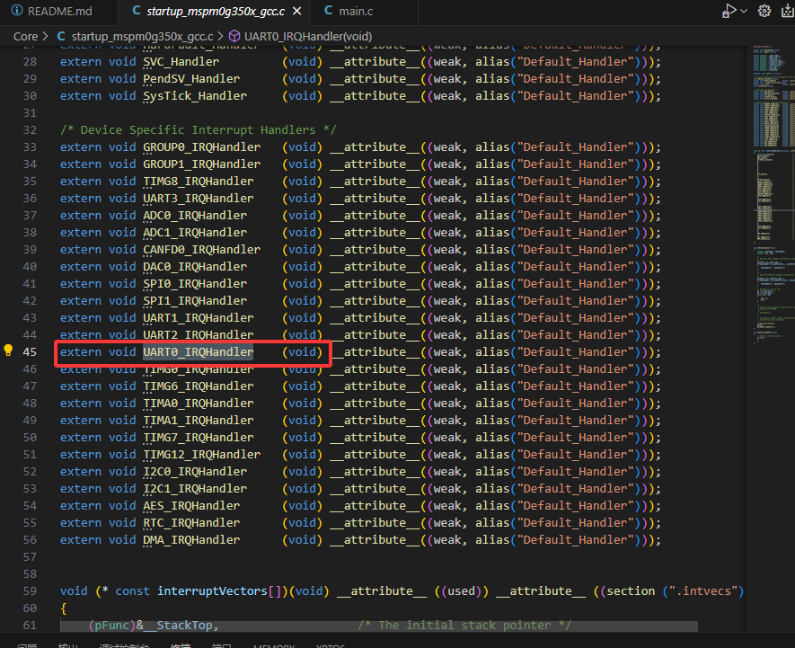

也可以在我们生成的ti_msp_dl_config.h文件中看到关于串口0中断服务函数的宏定义。

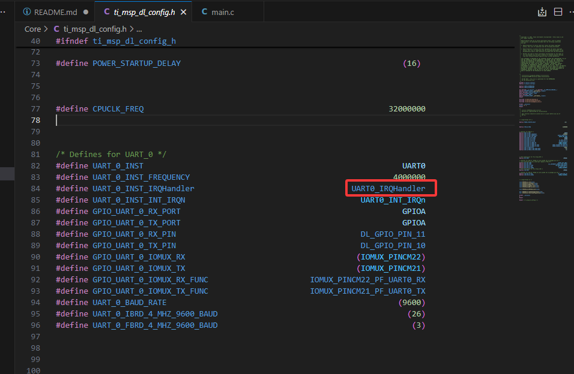

在empty.c（有main函数的文件）中编写如下代码：

```c
#include "ti_msp_dl_config.h"

volatile unsigned int delay_times = 0;
volatile unsigned char uart_data = 0;

void delay_ms(unsigned int ms);
void uart0_send_char(char ch);
void uart0_send_string(char* str);

int main(void)
{
    SYSCFG_DL_init();
    //清除串口中断标志
    NVIC_ClearPendingIRQ(UART_0_INST_INT_IRQN);
    //使能串口中断
    NVIC_EnableIRQ(UART_0_INST_INT_IRQN);

    while (1)
    {
        //LED引脚输出高电平
        DL_GPIO_setPins(LED_PORT, LED_PIN_14_PIN);
        delay_ms(500);
        //LED引脚输出低电平
        DL_GPIO_clearPins(LED_PORT, LED_PIN_14_PIN);
        delay_ms(500);
    }
}

//搭配滴答定时器实现的精确ms延时
void delay_ms(unsigned int ms)
{
    delay_times = ms;
    while( delay_times != 0 );
}
//串口发送单个字符
void uart0_send_char(char ch)
{
    //当串口0忙的时候等待，不忙的时候再发送传进来的字符
    while( DL_UART_isBusy(UART_0_INST) == true );
    //发送单个字符
    DL_UART_transmitData(UART_0_INST, ch);
}
//串口发送字符串
void uart0_send_string(char* str)
{
    //当前字符串地址不在结尾 并且 字符串首地址不为空
    while(*str!=0&&str!=0)
    {
        //发送字符串首地址中的字符，并且在发送完成之后首地址自增
        uart0_send_char(*str++);
    }
}

//滴答定时器的中断服务函数
void SysTick_Handler(void)
{
    if( delay_times != 0 )
    {
        delay_times--;
    }
}

//串口的中断处理函数
void UART0_IRQHandler(void)
{
    //如果产生了串口中断
    switch( DL_UART_getPendingInterrupt(UART0) )
    {
        case DL_UART_IIDX_RX://如果是接收中断
            //接发送过来的数据保存在变量中
            uart_data = DL_UART_receiveData(UART0);
            //将保存的数据再发送出去
            uart0_send_char(uart_data);
            break;

        default://其他的串口中断
            break;
    }
}
```

将代码烧录到开发板中，通过串口调试助手发送数据给开发板，就可以看到开发板返回的数据。

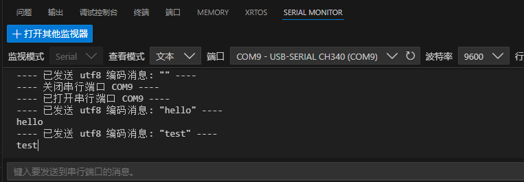

相关代码解析。

串口中断必须手动开启。通过函数 NVIC_EnableIRQ指定开启某一个中断。开启之前要先清除中断标志位，否则开启中断后将会自动进入中断。

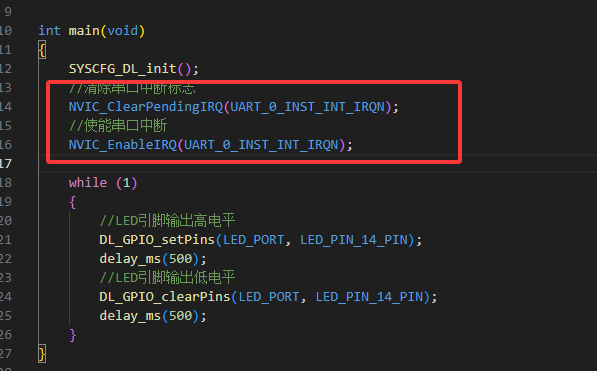

串口发送数据。可以通过函数 DL_UART_Main_transmitData 将字符数据发出。但为了确保不会阻塞发送通道的数据，需要增加忙判断。例如，你在发送ABCD时，刚刚准备发A，A还没有发送出去，芯片就要发送B了，这样就导致了数据丢失。
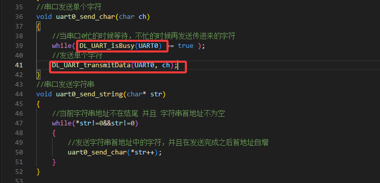

串口接收数据。接收数据本案例是通过串口中断接收的方式，一有数据过来就马上中断接收，非特殊情况不会有阻塞。

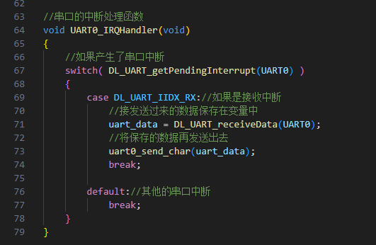

如需要使用C语言中的printf函数，需要进行以下操作。 在链接文件中修改堆栈的大小。此处我将堆大小修改为0x100。

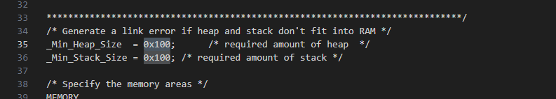

